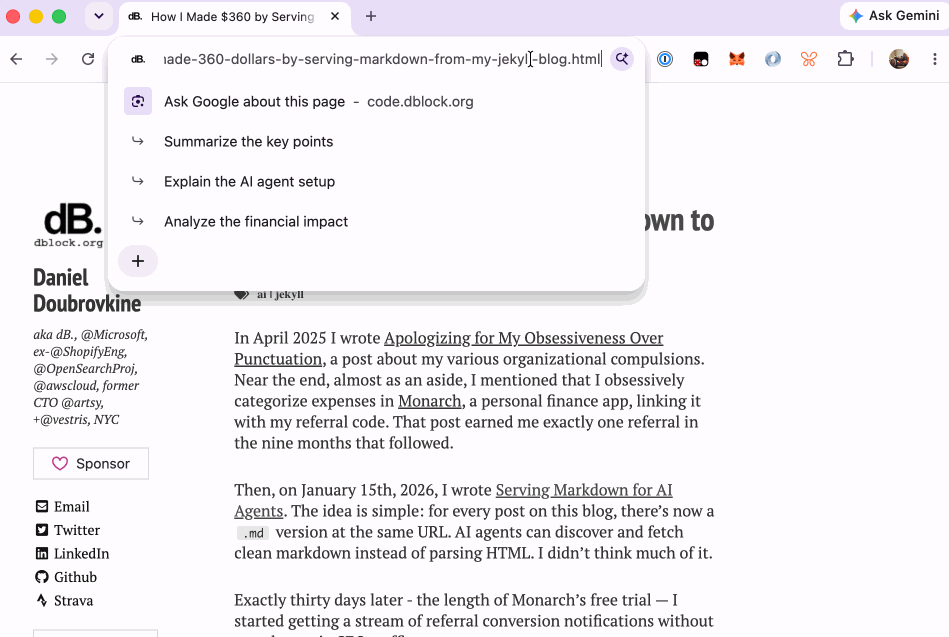

# jekyll-md

[](https://github.com/dblock/jekyll-md/actions/workflows/test.yml)
[](https://coveralls.io/github/dblock/jekyll-md?branch=main)

A Jekyll plugin that serves a clean Markdown version of every page, for AI agents and other machine readers.



For every rendered HTML page, `jekyll-md` writes a sibling `.md` file (e.g. `/about/index.html` -> `/about.md`) and adds a `<link rel="alternate" type="text/markdown">` tag to the page's `<head>` so agents can discover it. Read more in [Serving Markdown for AI Agents, Now as a Jekyll Plugin](https://code.dblock.org/2026/09/19/serving-markdown-with-a-jekyll-plugin.html).

## Installation

Add this line to your Jekyll site's `Gemfile`:

```ruby
group :jekyll_plugins do
  gem 'jekyll-md'
end
```

And then run `bundle install`.

> [!NOTE]
> This plugin requires a custom Ruby gem and therefore cannot run in GitHub Pages' default build (which only allows a fixed [whitelist of plugins](https://pages.github.com/versions/)). Deploy via a [GitHub Actions workflow](https://jekyllrb.com/docs/continuous-integration/github-actions/) that runs `bundle exec jekyll build` instead (GitHub Pages' "GitHub Actions" build type), and it will work.

## Usage

No configuration is required to get started; every rendered HTML page gets a Markdown counterpart.

### Configuring the CSS Selector

By default (no `selector` configured), `jekyll-md` looks for a `<main>` element or `[role="main"]` in the rendered page (the closest thing HTML has to a convention for "this is the content, not the header/nav/footer chrome"), and converts that. If your layouts don't use either of these, it falls back to converting the entire `<body>`, including navigation, headers, footers, and anything else on the page — this is simple but rarely what you want for a real site, since it dumps your header/nav/footer HTML into every single `.md` file.

Many themes (including Jekyll's default `minima`) already wrap page content in `<main>`, so this default may work with no configuration at all. Otherwise, set `selector` to a CSS selector that scopes the conversion to just your content, e.g. the wrapper `div` around `{{ content }}` in your layout:

```yaml
md:
  selector: "#markdown-content"
```

```html
<!-- _layouts/post.html -->
<article>
  <div id="markdown-content">
    {{ content }}
  </div>
</article>
```

You can override the selector for an individual page via front matter:

```yaml
---
md_selector: "#post-body"
---
```

### Other Configuration

```yaml
md:
  enabled: true              # master on/off switch, default true
  selector: "#markdown-content" # CSS selector to convert; default nil (try <main>/[role=main], then the whole page)
  strip: [script, style]    # elements always removed from the selected content before conversion
  link: true                 # inject <link rel="alternate" type="text/markdown"> into <head>, default true
  exclude:                   # array of URL glob patterns to skip entirely
    - /404.html
    - /assets/**
```

### Per-Page Front Matter

```yaml
---
md: false          # opt this page out of Markdown generation entirely
md_link: false     # generate the .md file, but don't add the <link> tag to this page
md_selector: "#x"  # override the selector for this page only
---
```

### Avoiding Clobbering Hand-Authored Markdown Pages

If a page at the derived destination path already exists after Jekyll writes the site (for example, you hand-author `/tags.md` yourself from a data-driven Liquid template), `jekyll-md` will not overwrite it.

## How It Works

`jekyll-md` hooks into two points in the Jekyll build:

1. `:pages`/`:documents`, `:post_render` — after a page's layout and Liquid have fully rendered, inject the `<link rel="alternate">` tag into its `<head>`.
2. `:site`, `:post_write` — after Jekyll has written the whole site to disk, walk every page and document, extract the configured selector (or the whole `<body>`) from its rendered HTML, convert it to Markdown, and write it next to the HTML output.

## llms.txt

`jekyll-md` intentionally does not generate an [`llms.txt`](https://llmstxt.org). The spec asks for a *curated* index that "stays small enough to fit in context," explicitly contrasting itself with `sitemap.xml`, which it criticizes for being too large and unfiltered. A plugin can't know which of your pages are worth surfacing, and dumping every post/page (as some plugins do) just recreates the sitemap problem in Markdown.

Instead, author `llms.txt` yourself as a plain Jekyll page with Liquid front matter, opting in specific content (e.g. via a per-page `pinned: true`/`llms: true` flag) rather than listing everything. See [code.dblock.org](https://code.dblock.org/llms.txt) for a working example that lists pinned highlights, the 10 most recent posts, and key pages out of a blog with almost 600 posts: the [template](https://github.com/dblock/code.dblock.org/blob/gh-pages/llms.txt) and the [commit that added it](https://github.com/dblock/code.dblock.org/commit/1a40e12).

## Similar Projects

### jekyll-llms

Unlike `jekyll-md`, [jekyll-llms](https://github.com/skatkov/jekyll-llms) generates Markdown sidecars from each page's **source** — your original Markdown/HTML file, with Liquid resolved but otherwise untouched — plus an `llms.txt` index. Inline HTML (`<a>`, ``, tables, embeds, etc.) leaks through verbatim, and only pages with Markdown/HTML source get a sidecar, not generated pages like tag or pagination pages.

### jekyll-markdown-output

Like `jekyll-llms`, [jekyll-markdown-output](https://github.com/abhinavs/jekyll-markdown-output) converts from each document's **source** rather than its rendered HTML, re-reading the original file from disk and re-rendering Liquid against it, so only docs in configured collections and pages with a `.md`/`.markdown` source file get a sidecar — not generated pages like tag or pagination pages. It also adds a synthetic YAML front matter block (title, date, url, summary, tags, category, author) and an optional `# Title` heading to each output file, which `jekyll-md` does not do, but it has no equivalent to `jekyll-md`'s `<link rel="alternate" type="text/markdown">` discovery tag, so agents have to guess the `.md` URL exists rather than find it in the page's `<head>`.

## Contributing

See [CONTRIBUTING](CONTRIBUTING.md).

## Copyright and License

MIT License, see [LICENSE](LICENSE.md) for details.
